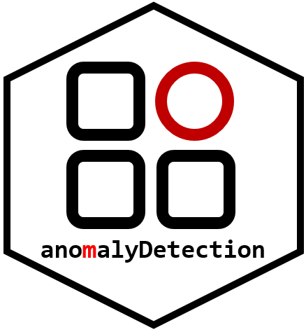

<!-- README.md is generated from README.Rmd. Please edit that file -->

anomalyDetection 
=====================================================================================================

`anomalyDetection` implements procedures to aid in detecting network log anomalies. By combining various multivariate analytic approaches relevant to network anomaly detection, it provides cyber analysts efficient means to detect suspected anomalies requiring further evaluation.

Installation
------------

You can install `anomalyDetection` two ways.

-   Using the latest released version from CRAN:

<!-- -->

    install.packages("anomalyDetection")

-   Using the latest development version from GitHub:

<!-- -->

    if (packageVersion("devtools") < 1.6) {
      install.packages("devtools")
    }

    devtools::install_github("koalaverse/anomalyDetection", build_vignettes = TRUE)

Learning
--------

To get started with `anomalyDetection`, read the intro [vignette](https://cran.r-project.org/web/packages/anomalyDetection/vignettes/Introduction.html): `vignette("Introduction", package = "anomalyDetection")`. This will provide a thorough introduction to the functions provided in the package.

References
----------

Gutierrez, R.J., Boehmke, B.C., Bauer, K.W., Saie, C.M. & Bihl, T.J. (2017) "`anomalyDetection`: Implementation of augmented network log anomaly detection procedures." The R Journal, 9(2), 354-365. [link](https://journal.r-project.org/archive/2017/RJ-2017-039/index.html)
